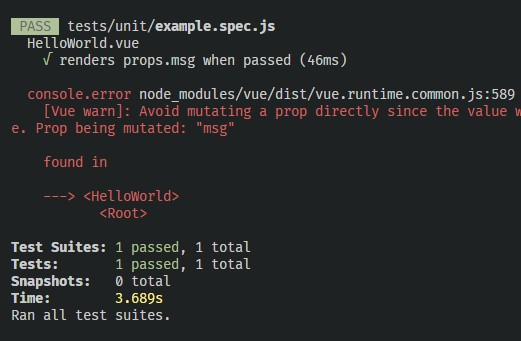

# Vue/Jest console.error bug

This repo shows a bug in Vue where it incorrectly catches errors during Jest tests, believing that it's in a browser.

## Relevant files modified
* [HelloWorld.vue](https://github.com/chris-sorrells/vue-jest-console-error-bug/blob/master/src/components/HelloWorld.vue) - Adds a `mounted()` section which causes Vue to throw an exception. (commit: abf6a4d00981ae6d13ed1969f5ec0340aec5d84d)

## Triggering the bug
- Clone this repo
- Run `npm install`
- Run `npm run test:unit`

## Results

